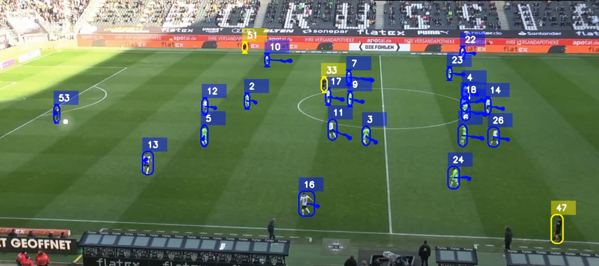

# ⚽ Football Player Detection, Tracking & Analysis using YOLO11 + ByteTrack

---

## 📌 Introduction

This project focuses on **real-time football player detection, multi-object tracking, and match analysis** using **YOLO11** and **ByteTrack**.

The system is capable of detecting and tracking:

- Players
- Goalkeepers
- Referees
- Football

across video frames with high accuracy and real-time performance.

The project combines:

- **YOLO11** for object detection
- **ByteTrack** for robust multi-object tracking

to generate smooth and consistent tracking IDs throughout the match.

---

## 🖼️ Project Overview

  

---

# 🚀 Features

✅ Real-time football player detection  
✅ Multi-object tracking with unique tracking IDs  
✅ Ball detection and tracking  
✅ Referee detection  
✅ Goalkeeper identification  
✅ High FPS inference  
✅ Video-based analysis pipeline  
✅ YOLO11 transfer learning  
✅ ByteTrack integration  
✅ Output visualization with bounding boxes and IDs  

---

# 📊 Dataset

## 🔹 Roboflow Dataset

Dataset used for training:

[https://universe.roboflow.com/](https://universe.roboflow.com/roboflow-jvuqo/football-players-detection-3zvbc)

---

## 🔹 Input Video

The football match video used for testing is available in:

[▶️ View Input Video](./video/video.mp4)

---

# 📈 Dataset Statistics

| Dataset Split | Number of Images |
|---|---|
| Training Images | 612 |
| Validation Images | 38 |

---

# 🧠 Technologies and requiremnts 

| Technology | Purpose |
|---|---|
| YOLO11 | Object Detection |
| ByteTrack | Multi-Object Tracking |
| OpenCV | Video Processing |
| Python | Development |
| PyTorch | Deep Learning Framework |
| Ultralytics | YOLO Framework |

---

# 🏗️ YOLO11 Architecture

YOLO11 is a modern real-time object detection architecture optimized for:

- High accuracy
- Fast inference
- Multi-scale object detection

---

## 🔹 YOLO11 Components

### 📌 Backbone

Extracts important image features.

Includes:

- Convolution Layers
- C3k2 Blocks
- SPPF (Spatial Pyramid Pooling Fast)

---

### 📌 Neck

Combines multi-scale feature maps using:

- Upsampling
- Feature Concatenation

---

### 📌 Head

Performs:

- Bounding Box Prediction
- Class Prediction
- Confidence Score Estimation

---

# 📌 Model Summary

| Property | Value |
|---|---|
| Model | YOLO11l |
| Layers | 358 |
| Parameters | 25.3 Million |
| GFLOPs | 87.3 |

---

# 🔄 Data Augmentation

To improve model robustness and generalization, several augmentations were applied during training.

| Augmentation | Purpose |
|---|---|
| Median Blur | Reduces image noise |
| ToGray | Improves robustness |
| CLAHE | Enhances contrast |
| Rotation | Rotation invariance |
| Horizontal Flip | Orientation robustness |
| Scaling | Scale invariance |

---

# 🎯 Transfer Learning

Pretrained YOLO11 weights were used to accelerate training and improve feature extraction.

### ✅ Benefits

- Faster convergence
- Better feature extraction
- Improved detection accuracy

# 🔍 ByteTrack for Multi-Object Tracking

## 📌 What is ByteTrack?

ByteTrack is a high-performance multi-object tracking algorithm that:

- Associates detections across frames
- Maintains consistent IDs
- Handles occlusions effectively
- Provides stable tracking performance

---

## 📌 Why ByteTrack?

✅ High tracking accuracy  
✅ Real-time performance  
✅ Low ID switching  
✅ Robust in crowded scenes  

---

## 📌 ByteTrack Working Pipeline

1. Object detection using YOLO11
2. Confidence score filtering
3. Motion association between frames
4. Track ID assignment
5. Continuous object tracking

---

# 📹 Detection & Tracking Output

The final processed output video is available in:

[🎯 View Output Video](./output/output.avi)

---

# 📊 Results

## 🔹 Overall Performance

| Metric | Value |
|---|---|
| Precision | 0.883 |
| Recall | 0.823 |
| mAP50 | 0.828 |
| mAP50-95 | 0.567 |

---

# 📌 Class-wise Performance Analysis

| Class | Precision | Recall | mAP50 | mAP50-95 |
|---|---|---|---|---|
| Ball | 0.772 | 0.388 | 0.392 | 0.152 |
| Goalkeeper | 0.864 | 0.963 | 0.958 | 0.705 |
| Player | 0.949 | 0.987 | 0.992 | 0.769 |
| Referee | 0.946 | 0.955 | 0.969 | 0.641 |

---

### ✅ Suitable For

- Real-time sports analytics
- Match analysis
- Tactical player tracking
- Automated football analysis systems

---

# 🎥 Output Visualization

The output video contains:

- Bounding boxes
- Tracking IDs
- Ball tracking
- Referee tracking
- Goalkeeper tracking

---

# 📌 Future Improvements

- Ball trajectory prediction
- Team classification
- Tactical heatmaps
- Player re-identification
- Real-time dashboard analytics

---

If you found this project useful, give this repository a ⭐ on GitHub!

---
